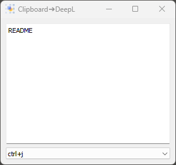
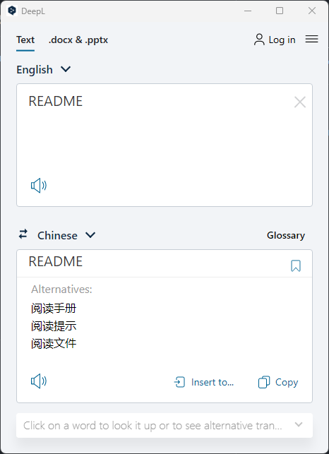

# Deepl Translator Helper

This program can watching your clipboard change then emit a hotket event to activate DeepL translator application.
<p align="center">
  
</p>
<p align="center">
  
</p>


## Dependency
- python(latest version)

- pyperclip 

- keyboard 

- PyQt5

### Install Dependency

```shell
pip install pyperclip keyboard PyQt5
```

## Run

python clipboard-broker.pyw

## Usage

- open DeepL Translator
- run this program
- change setting of DeepL Translator to match our hotkey
- copy your text from anywhere(then things will happen)

## Other

- DeepL Translator for windwos [link](https://www.deepl.com/en/app/?utm_medium=app-promo-translator)
- Only tested with Python 3.10.1 (tags/v3.10.1:2cd268a, Dec  6 2021, 19:10:37) [MSC v.1929 64 bit (AMD64)] on win32


